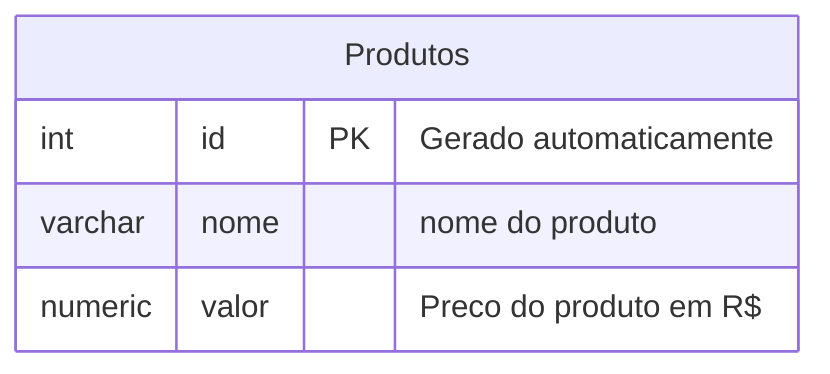

##

Para apagar um banco de dados, utilizamos o comando
```sql
DROP DATABASE cidades;
```

>Não esquecer do ;

---

**Modelagem do banco de dados**



Após modelar, iremos executar as etapas de criação e inserção de dados

**IMPORTANTE**
---
---
Para criar a primeira tabela, usamos os comandos:
```sql
CREATE TABLE produtos(
    id INT GENERATED ALWAYS AS IDENTITY PRIMARY KEY,
    nome VARCHAR(100) NOT NULL,
    valor NUMERIC(10,2) NOT NULL,
    estoque INT NOT NULL DEFAULT 0
);

```
--- 
para consultar todos os elementos da tabela, uso o comando:
```sql
SELECT * FROM produtos;
```
para insserir dados na tabela, usamos o comando
---
```sql
INSERT INTO produtos(nome,valor,estoque)
VALUES('Caneta','1.50','100');
```